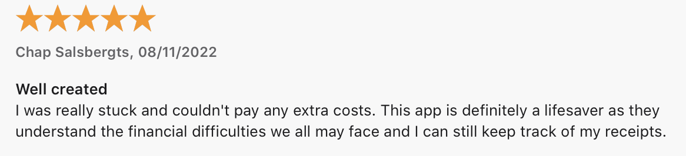
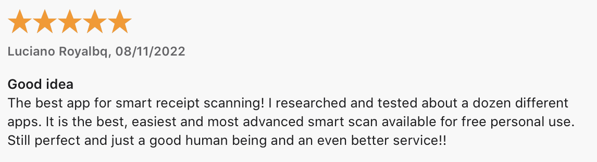
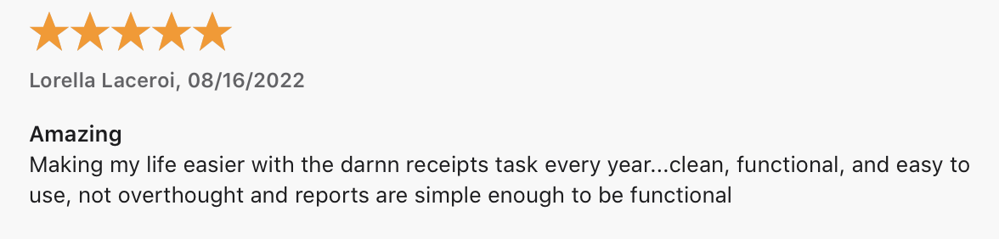
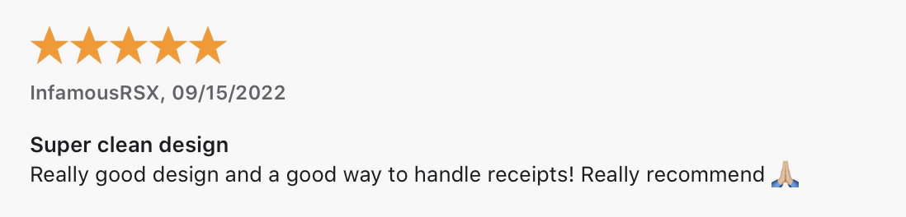

**Last updated**  
September 18 2022

# Press Kit
 

Help Receipts Co grow! I’m Karmjit, the developer of this app. I’m the only developer of the app so I really appreciate your help. If you have any questions just message me on [twitter]([http://twitter](https://twitter.com/CodeWithKarma)), or [email](support@receiptsco.app).

## Description
Receipts Co is an app to help scan, search receipts and expenses smartly. Search your entire catalog of receipts in a split second. Search in receipts using store name, product name, title etc. Create lists of categories and tags instantly to organise your receipts. 

Receipts Co was designed with privacy in mind, so all processes happen offline and nothing ever leaves your phone. There are no servers, no data collection, no analytics, and no internet connection is required except if you want to sync your receipts across multiple devices.

Receipts Co is a free app to download and have no ads. There are in app purchases if you want to do advance activities like export your receipts to pdf etc. 

## Screenshots & Assets
[Download Press Kit]({{ site.url }}/downloads/presskit.zip)

 

## Features
- Quick Create: 
  - Quickly create using a camera to take a photo or choose from your photo library to use existing photos. 
- Smart Scan: 
  - Smart scan, when enabled will try to get the data from the receipts to make the create receipt fast. 
  - Smart scan try to extract store name, amount spent and date spent from the receipt to make to help you quickly save them. 
- Easy Organise: 
  - The app helps you keep your receipts in an organized way for easy search. 
    - Just create different categories to manage them. 
    - Landlords can create categories for each of their properties to keep record of expenses for each property. 
- Product Tracking: 
  - Keep an eye on the product warranties by getting notifications. 
- Tagging: 
  - Tag the receipts to search them easily later.
  - You can assign multiple tags for more smarter and easier search.
- Widgets: 
  - Beautiful widgets to keep an eye on the spending summary on a store or product. 
- Settings: Customize your app
  - Manage your categories
  - Manage your tags
  - Review the app
  - Send feedback
  - Change App Icon
- Search bar: Use to search for receipts using receipts name, category name or product name. 

## In app Purchase
There are in app purchases to give you extra features. All the basic features are totally free and there is no limit on those features. Features unlocked with pro subscription are
- App Icon: 
  - You can choose from different set of app icons and choose the one you like. 
- Export:
  - Export the receipts to pdf
  - Filters are availble to choose a simple export or detailed export with images. 

 

## Helpful links
### Receipts Co App Store URL
https://apps.apple.com/app/id1532569828

### Receipts Co App Store Short URL
https://apple.co/3xxJMoB

### Find website
https://receiptsco.app

### Developer Twitter
https://twitter.com/CodeWithKarma

### Receipts Co app twitter
https://twitter.com/ReceiptsC

## Accolades

## About the developer
I’m Karmjit Singh, an iOS developer living in Brisbane Australia. Besides coding, I like to play badminton and gardening.

Receipts Co is my first and most fully-featured app. A couple of years ago, I was at the store and I needed to find my receipt for that store and I could not. I looked for some apps in the AppStore to manage receipts but they were not fulfilling all my needs like group by store, tags, and search and warranties. 
I decided to build my own app.It has been an amazing journey and I am still working on great features for this app. but I think it’s gotten to be pretty useful for stuff beyond that. But anyway, I’m very committed to user privacy. No one likes apps that sell your data. My app don’t collect data, and have pro features for pro users who want to do more that just saving and searching of receipts.

You can contact me anytime on [twitter]([http://twitter](https://twitter.com/CodeWithKarma)), or [email](support@receiptsco.app).