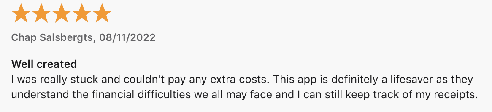
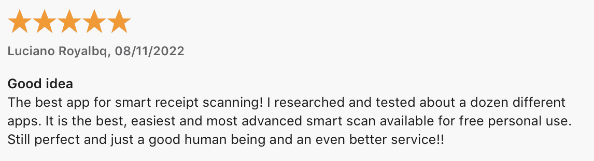
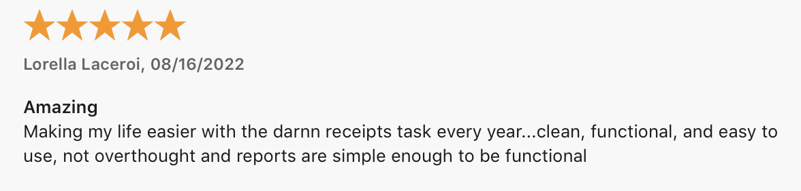
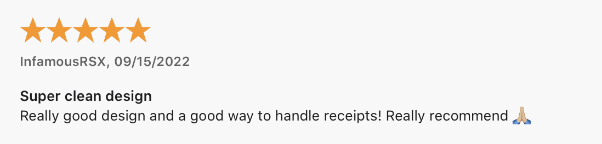

**Last updated**  
7 September 2026

# Press Kit
 

Help Receiptly grow! I’m Karmjit, the developer of this app. I’m the only developer of the app so I really appreciate your help. If you have any questions, message me on [Twitter](https://twitter.com/CodeWithKarma) or use the protected support link on the Receiptly website.

## Description
Receiptly is an app to help scan, search receipts and expenses smartly. Search your entire catalog of receipts in a split second. Search in receipts using category name, product name, title etc. Create lists of categories and tags instantly to organise your receipts. 

Receiptly was designed with privacy in mind. Scanning and storage start on your device, and there is no Receiptly account. On iPhone and iPad, optional iCloud sync can copy your library between Apple devices. On Android, receipts stay on that device and do not sync with iPhone. Optional Smart Scan can send a reduced receipt image to Google AI for harder receipts. Firebase records basic product analytics and crash diagnostics, not your receipt content.

Receiptly is free to download and has no ads. Optional Receiptly Pro (iOS) and Receiptly Plus (Android) purchases unlock extras such as Smart Scan, exports, and full reports. 

## Screenshots & Assets
[Download Press Kit]({{ site.url }}/downloads/presskit.zip)

 

## Features
- Quick Create: 
  - Quickly create using a camera to take a photo or choose from your photo library to use existing photos. 
- Smart Scan: 
  - Smart scan, when enabled will try to get the data from the receipts to make the create receipt fast. 
  - Smart scan try to extract category name, amount spent and date spent from the receipt to make to help you quickly save them. 
- Easy Organise: 
  - The app helps you keep your receipts in an organized way for easy search. 
    - Just create different categories to manage them. 
    - Landlords can create categories for each of their properties to keep record of expenses for each property. 
- Product Tracking: 
  - Keep an eye on the product warranties by getting notifications. 
- Tagging: 
  - Tag the receipts to search them easily later.
  - You can assign multiple tags for more smarter and easier search.
- Widgets: 
  - Beautiful widgets to keep an eye on the spending summary on a category or product. 
- Settings: Customize your app
  - Manage your categories
  - Manage your tags
  - Review the app
  - Send feedback
  - Change App Icon
- Search bar: Use to search for receipts using receipts name, category name or product name. 

## In app Purchase
There are in-app purchases for extra features. Receiptly Pro on iOS and Receiptly Plus on Android can unlock:
- App Icon: 
  - You can choose from different set of app icons and choose the one you like. 
- Export:
  - Export the receipts to pdf
  - Filters are availble to choose a simple export or detailed export with images. 

 

## Helpful links
### Receiptly on the App Store
https://apps.apple.com/app/id1532569828

### Receiptly on the App Store (short URL)
https://apple.co/3xxJMoB

### Receiptly on Google Play
https://play.google.com/store/apps/details?id=com.karmafyapps.receiptly

### Website
https://receipttrackerapp.com/

### Developer Twitter
https://twitter.com/CodeWithKarma

### Receiptly app twitter
https://twitter.com/ReceiptsC

## Accolades

## About the developer
I’m Karmjit Singh, a developer living in Brisbane, Australia. Besides coding, I like to play badminton and gardening.

Receiptly is my first and most fully-featured app, now on iPhone, iPad, and Android. I’m committed to user privacy: there is no Receiptly account, receipt content stays on the device unless you turn on optional Smart Scan, and we do not sell your data. Receiptly Pro on iOS and Receiptly Plus on Android unlock extras for people who want more than saving and searching receipts.

You can contact me anytime on [Twitter](https://twitter.com/CodeWithKarma) or through the protected support link on the Receiptly website.
